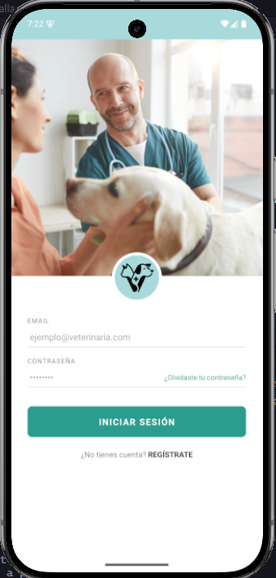
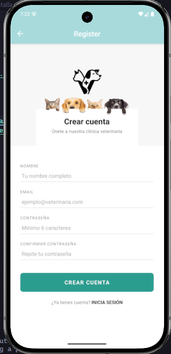
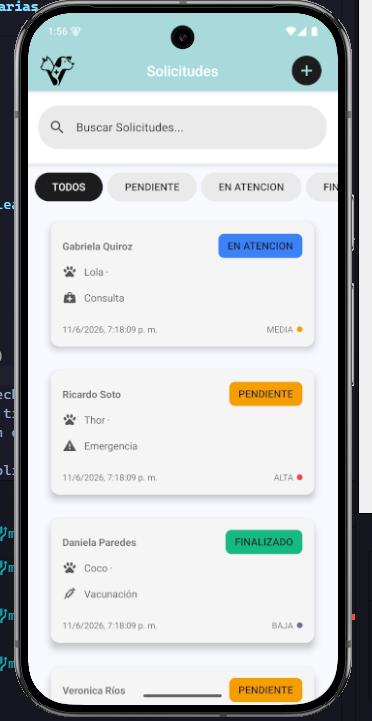
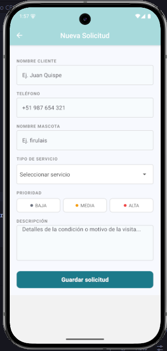
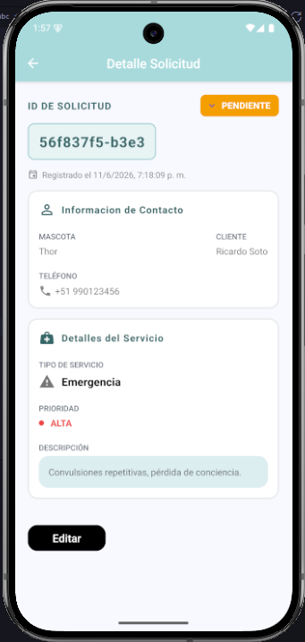
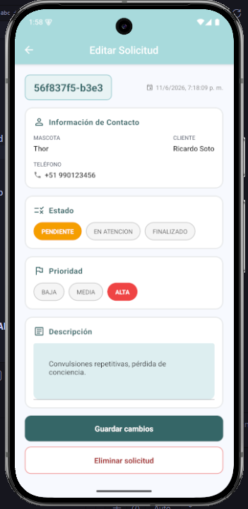

# VetApp 🐾 — Gestión de Solicitudes Veterinarias

Aplicación móvil desarrollada en React Native con Expo para gestionar solicitudes de atención de una clínica veterinaria.

---

## 📋 Descripción del caso

Una clínica veterinaria recibía solicitudes de atención de forma informal por WhatsApp y llamadas telefónicas, lo que generaba pérdida de información, duplicidad de registros y falta de claridad sobre el estado de cada atención.

VetApp reemplaza ese proceso con una aplicación móvil que permite autenticarse, registrar, listar, editar y eliminar solicitudes de atención, con filtros por estado y búsqueda por nombre de cliente.

### Objetivo

Construir una aplicación móvil en React Native que permita gestionar solicitudes de atención veterinaria aplicando fundamentos de desarrollo móvil, componentes reutilizables, hooks personalizados y principios de Clean Architecture.

---

## 👥 Integrantes

- Integrante 1 — JOEL ANDERSON MACHACA NINA
- Integrante 2 — WALTER MALPARTIDA SOTO
- Integrante 3 — MARICIELO FERNANDA OCHOA GARCIA

---

## ✅ Requisitos previos

| Herramienta | Versión recomendada |
|---|---|
| Node.js | v18 o superior |
| npm | v9 o superior |
| Expo CLI | npx (sin instalación global) |
| Android Studio | Última versión estable |
| JDK | 17 |

---

## 🚀 Instalación

1. Clona el repositorio:
```bash
git clone https://github.com/JoelDev2002/veterinaria-app.git
cd veterinaria-app
```

2. Instala las dependencias:
```bash
npm install
```

---

## ▶️ Ejecución

### Con Expo Go (más rápido)
```bash
npx expo start
```
Escanea el QR con la app Expo Go en tu celular.

### En emulador Android
```bash
npx expo start
# Presiona "a" para abrir en emulador Android
```

### Build Android (APK)
```bash
# Paso 1 — Generar carpeta nativa
npx expo prebuild --platform android

# Paso 2 — Compilar APK
cd android
.\gradlew assembleRelease   # Windows
./gradlew assembleRelease   # Mac/Linux
```

El APK quedará en:
```
android/app/build/outputs/apk/release/app-release.apk
```

---

## 🔐 Acceso a la aplicación

Al abrir la app se muestra la pantalla de **Login**. La autenticación es simulada — no hay base de datos de usuarios real.

1. Ingresa cualquier usuario y contraseña en los campos correspondientes
2. Ambos campos son obligatorios — si están vacíos se muestra un mensaje de validación
3. Toca **Ingresar** → si los campos son válidos, accedes a la pantalla Home
4. Si no tienes cuenta, toca **Registrarse** para ir a la pantalla de Register (también simulada)

---

## 🔄 Cómo probar el flujo CRUD

### Crear solicitud
1. Desde Home toca **Nueva Solicitud** (o el botón **+** en el listado)
2. Completa el formulario: nombre del cliente, teléfono, nombre de la mascota, tipo de servicio, prioridad y descripción
3. Toca **Guardar solicitud** → la solicitud aparece en el listado con estado PENDIENTE

### Ver detalle
1. En el listado toca cualquier tarjeta de solicitud
2. Se muestra el detalle completo: datos del cliente, mascota, tipo de servicio, prioridad y descripción

### Editar solicitud
1. Desde el detalle toca **Editar**
2. Modifica el estado, prioridad o descripción
3. Toca **Guardar cambios** y confirma → los cambios se reflejan en el listado

### Eliminar solicitud
1. Desde la pantalla de edición toca **Eliminar solicitud**
2. Confirma en el modal de confirmación
3. La solicitud desaparece del listado
> ⚠️ Solo se pueden eliminar solicitudes en estado **PENDIENTE**

### Filtrar y buscar
1. En el listado usa los chips: **TODOS / PENDIENTE / EN ATENCIÓN / FINALIZADO**
2. Usa el buscador para filtrar por nombre de cliente

---

## 🏗️ Arquitectura del proyecto

El proyecto aplica bases de **Clean Architecture**, separando responsabilidades en capas bien definidas:

```
src/
├── models/        → Entidades puras sin dependencias externas (Solicitud, Usuario, enums)
├── usecases/      → Lógica de negocio separada de la UI
│   ├── CrearSolicitud.ts      → genera id, fecha y estado inicial
│   ├── EditarSolicitud.ts     → aplica cambios sobre la solicitud original
│   ├── EliminarSolicitud.ts   → valida que solo se eliminen solicitudes PENDIENTE
│   ├── LoginUsuario.ts        → simula la autenticación
│   └── RegisterUsuario.ts     → simula el registro de usuario
├── hooks/         → Hooks personalizados que conectan UI con use cases
│   ├── useLoginForm.ts            → estado, validación y submit del login
│   ├── useRegisterForm.ts         → estado, validación y submit del registro
│   ├── useCrearSolicitudForm.ts   → estado y validación del formulario de crear
│   └── useEditarSolicitudForm.ts  → estado, validación, editar y eliminar
├── context/       → Estado global con Context API + useReducer
│   ├── SolicitudContext.tsx   → provee el estado a toda la app
│   └── solicitudReducer.ts    → maneja las acciones AGREGAR, EDITAR, ELIMINAR, CAMBIAR_ESTADO
├── screens/       → Pantallas que coordinan UI, hooks y navegación
│   ├── LoginScreen.tsx
│   ├── RegisterScreen.tsx
│   ├── HomeScreen.tsx
│   ├── CreateScreen.tsx
│   ├── DetailScreen.tsx
│   └── EditScreen.tsx
├── components/    → Componentes reutilizables con Props y TypeScript
├── navigation/    → Configuración de navegación entre pantallas
└── utils/
    ├── constants.ts   → colores, iconos, labels centralizados
    └── validators.ts  → validaciones reutilizables independientes de la UI
```

### Principios aplicados
- Los **modelos** son puros — no dependen de ningún framework
- Los **casos de uso** contienen las reglas de negocio — las pantallas no deciden el id, la fecha ni el estado inicial
- Los **hooks personalizados** encapsulan el estado del formulario y las validaciones fuera de la UI
- Los **componentes** solo muestran datos — sin lógica de negocio
- Los **validators** son independientes — reutilizables en cualquier pantalla o hook
- Los **labels y colores** están centralizados — un solo lugar para cambiar la presentación

### Hooks utilizados
- `useState` — manejo de formularios y errores
- `useEffect` / `useLayoutEffect` — configuración del header de navegación
- `useReducer` — gestión del estado global
- `useContext` — acceso al estado desde cualquier pantalla
- **Hooks personalizados** — `useLoginForm`, `useRegisterForm`, `useCrearSolicitudForm`, `useEditarSolicitudForm`

---

## 📱 Tecnologías

- React Native + Expo
- TypeScript
- React Navigation (native-stack)
- React Native Paper (componentes UI)
- Context API + useReducer (estado global en memoria)

---

## 📸 Capturas de pantalla

| Login | Register |
|---|---|
|  |  |

| Listado | Crear | Detalle | Editar |
|---|---|---|---|
|  |  |  |  |